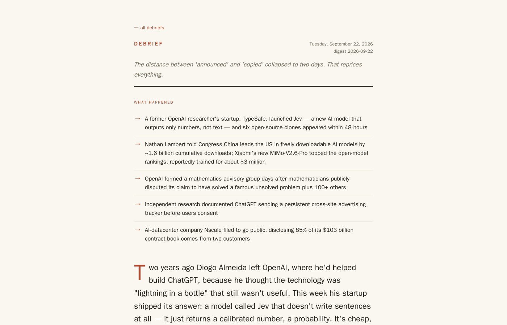

# Debrief

Debrief is the AI/ML briefing I read every morning. It's published at
**[debrief.alexwoodka.com](https://debrief.alexwoodka.com)**, usually a little after 9am Eastern. Each day
a Python collector pulls in around 2,900 items from arXiv, Hugging Face Daily Papers, Hacker News, Reddit,
lab blogs, tech press, funding news and six newsletters. Claude Code then reads a trimmed-down version of
that pile with a group of subagents and writes one article about what happened and why it matters.

It has run on its own on my home server every day since 2026-09-14. Before that it ran on my Mac.



An issue opens with a short "What happened" list of plain facts, then a lead essay and a few themed
sections, with gems called out inline. After that comes a one-line index of everything else worth
knowing, upcoming conference deadlines, and a note on which sources failed that day. Issues so far have
run 3,000 to 4,000 words.

## What it's looking for

Most AI news is about things everyone has already heard of. What I wanted to catch is the paper or release
that researchers have started building on and talking about but that hasn't reached the newsletters and
tech press yet.

So the collector gives every item three scores. The in-field score is about whether people in the field are
building on it or discussing it: Hugging Face models, datasets and Spaces that link to a paper, citations,
and mentions on Reddit and Lobsters. The mainstream score is about whether the crowd already knows: coverage
in the newsletters, Hacker News points, tech press, and official lab announcements. The insider score is
popularity among practitioners (HF upvotes, GitHub stars, Show HN posts), the one-click kind that doesn't
mean anyone is building on it, so it's only there for context. Divergence is in-field minus mainstream, and
a paper that's high on the first and low on the second is what the article calls a gem. The scores are used
to pick what the model gets to read (the digest, described below) and are shown next to each item as
evidence, but the call on what matters is left to the model. All the weights live in `collector/config.py`.

Two signals I designed for aren't contributing right now. GitHub code search for independent
implementations is switched off, because it's slow, rate-limited and almost always zero for papers this
new. The Bluesky source has no accounts configured, so it returns nothing.

## How a run works

1. Collect (6 to 9 minutes). `collector/collect.py` fetches every source. Each source is wrapped so a
   failure gets logged and skipped without stopping the run. Items are deduplicated by arXiv ID, URL or
   title, the same model release reported by several outlets is merged into one entry, and promo and
   off-topic posts are flagged. Candidate papers get looked up on Hugging Face and Semantic Scholar.
   Everything is scored and saved as a snapshot in SQLite so later runs can tell what's picking up speed.
   HTTP responses are cached for six hours.
2. Build the digest. Out of roughly 2,500 papers, the ones with any real signal (usually 125 to 160) clear
   a floor, and the top 50 go forward, with 15 of those slots held for papers too new to have signal yet.
   Other kinds of items have their own caps, and no single feed gets more than four slots in a section.
   The linked page for each item is fetched and cut to 6,000 characters of text. On 2026-09-22 the digest
   came to 158 items in total, out of 2,753.
3. Summarize. Inside Claude Code, `/debrief` starts four Claude Sonnet subagents in parallel. Each writes a
   neutral 120 to 200 word summary of every item in its slice (papers; repos and startups; releases, labs
   and news; discussion, funding and deadlines).
4. Review. Five more Sonnet subagents, which the prompts call seats, read the whole summarized digest.
   Each looks at it from one angle and returns a verdict on every item plus its 8 to 12 strongest picks.
   They only have the Read tool.

   | Seat | The question it asks | Its verdicts |
   |---|---|---|
   | Engineer | Does it work, how, and what does it let builders do that they couldn't before? | build-now, worth-internalizing, watch, skip |
   | Founder | What's newly possible, and where's the opening? | pursue-now, worth-exploring, watch, pass |
   | Investor | Where are attention, talent and money moving, and who captures the value? | position-now, track, watch, fade |
   | Competitive Scout | Who is moving on whom? | defend-now, monitor, watch, no-threat |
   | Skeptic | Is it real past the hype, in either direction? | underrated, overhyped, holds-up, unproven |

   Any seat can also answer `insufficient-info`.
5. Write. A Claude Opus pass reads the five memos and writes one article in a single voice. It never names the
   seats; where they disagree, the article gives a bull case and a bear case. It's allowed two or three
   web fetches to check its biggest claims. The result is saved as `debrief.md` and `debrief.json` under
   `data/debriefs/<date>/`.
6. Build. `dashboard/render.py` turns the JSON into a self-contained HTML page, and
   `dashboard/build_site.py` rebuilds the archive in `site/`.

A full run takes 25 to 31 minutes, and most of that is the agent steps.

## Running it yourself

You'll need Python (the server uses 3.13) and Claude Code logged in on a Max plan.

```sh
python3 -m venv .venv
.venv/bin/pip install -r requirements.txt
cp .env.example .env
.venv/bin/python collector/check_keys.py
```

No key is strictly required. `GITHUB_PAT` raises GitHub's rate limit when fetching the READMEs of trending
repos, `PRODUCTHUNT_TOKEN` turns on the Product Hunt source, and a Semantic Scholar key only raises that
API's rate limit. Don't set `ANTHROPIC_API_KEY`. With it set, Claude Code bills the API per token instead
of using your subscription, and `/debrief` stops before doing anything if it sees one.

To run just the collector:

```sh
.venv/bin/python -m collector.collect                 # writes data/digest_input.* and data/agent_digest.*
.venv/bin/python -m collector.collect --max-arxiv 300 # smaller and faster, for testing
```

It also takes `--days-papers` (default 14) and `--days-news` (default 4). For the whole thing, open
Claude Code in the repo and run `/debrief`, or `/debrief --skip-collect` to reuse the last collection.
`make site` builds the archive into `site/`, and `make preview` serves it at http://localhost:8000.

One catch: the command and summarizer prompts use the absolute path `/Users/alex/Documents/debrief`,
which is where my Mac checkout lives (the server image copies the repo to the same path). If your checkout
is somewhere else, change that path in `.claude/commands/debrief.md` and `.claude/agents/summarizer.md`
first.

## How it runs on the server

A systemd timer starts the run at 08:30 America/New_York, with up to 10 minutes of random delay. Each step
runs in its own throwaway Docker container built from one pinned image. The collector gets the source API
keys and no Claude login. The agent step gets the Claude token and no source keys, runs without a Bash
tool, sees the code read-only and can only write to `data/`. The build step has no network access. The
finished site is swapped into place atomically, and Caddy serves it through a Cloudflare Tunnel. The server
scripts aren't in this repo; [ROADMAP.md](ROADMAP.md) describes them and has the ops notes.

## Layout

```
collector/           the collector; collect.py is the entry point, config.py has the feeds, weights and caps
collector/sources/   one module per source
.claude/commands/    debrief.md, the /debrief command
.claude/agents/      the summarizer and the five seats
dashboard/           render.py, build_site.py and the HTML templates
docs/                the original spec, the design record and the source catalogue
```

A run writes everything to `data/`, which is gitignored: the raw and agent digests, the fetched page text,
the snapshot database, the HTTP cache, and one folder per day under `data/debriefs/`.

## Known gaps

A few sources fail almost every day, and each issue's data caveats line says which. VentureBeat's AI feed
has returned HTTP 429 on every server run so far, and two or three of the five subreddit feeds usually do
too. Semantic Scholar rate-limits often enough that citation counts are frequently missing; on 2026-09-22
all four retries failed. On 2026-09-15 arXiv itself rate-limited the collector, and that day's issue was
built from Hugging Face Daily Papers alone. The arXiv query also stops at 2,500 results, which it hits
every day, so the paper window is really about eight days even though it's set to fourteen.

## Docs

- [ROADMAP.md](ROADMAP.md): how the daily run works and what's been deferred.
- [docs/SOURCES.md](docs/SOURCES.md): every source, wired or not, and how to add one.
- [docs/PLAN.md](docs/PLAN.md): the design record from June and July 2026. Parts of it are superseded, and
  ROADMAP.md and the code win where they disagree.
- [docs/PRD.md](docs/PRD.md): the spec I wrote before building it.
- [PROFILE.md](PROFILE.md): a template for the reader profile the seats used to reason against. I turned
  personalization off in July 2026, and nothing reads the file now.
